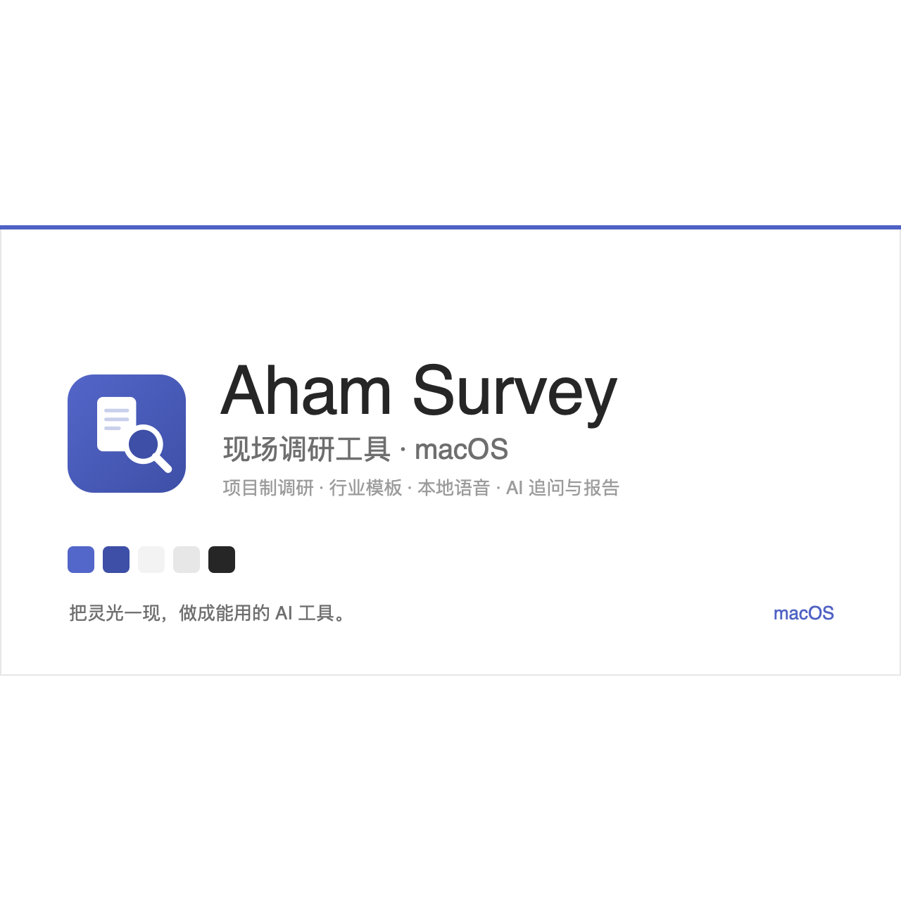
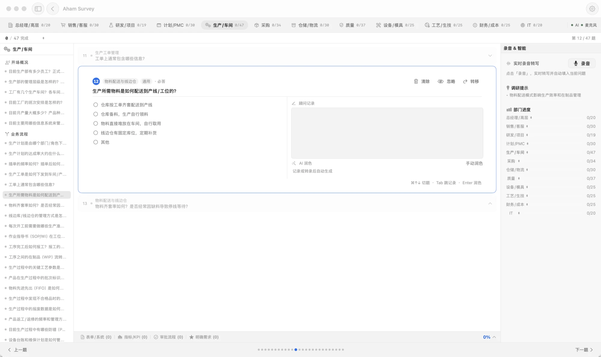
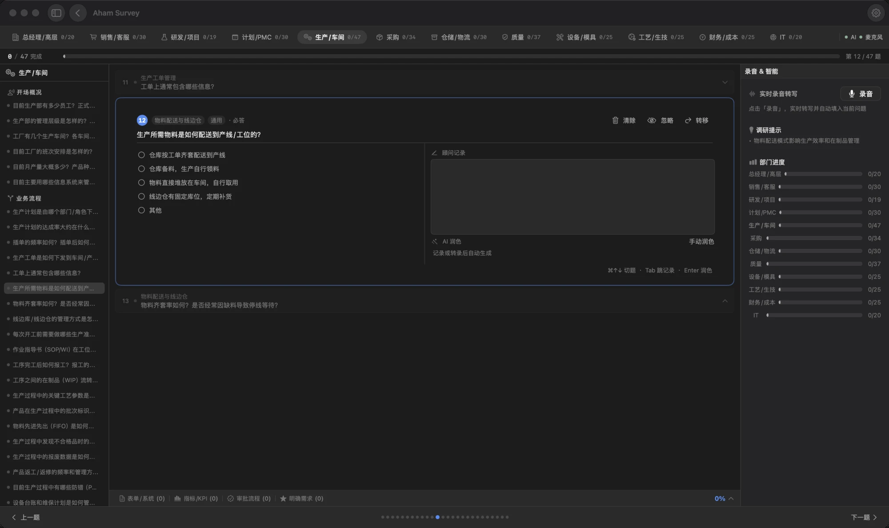

# Aham Survey — 现场调研工具（macOS）

## 为什么做

做 ERP / MES / WMS 这类信息化项目的售前与实施调研，现场常常一边聊一边手记，回去再对着录音和零散笔记重整理——费时，还容易漏细节、丢掉部门之间的对应关系。

Aham Survey 为此而做：它不止于「记下来」，而是把现场调研全流程结构化——按项目、按行业部门组织问卷，边问边记、本地转写，把对话沉淀成有结构、可导出的调研成果。

## 定位

- **专业** — 围绕真实售前 / 实施调研流程设计：项目、行业模板、部门问卷、聚焦式问答。
- **结构化** — 调研不是散记，而是按项目 / 部门 / 章节组织的成果，结束即可导出。
- **本地优先** — 数据存本机（SwiftData），AI 用你自行配置的 LLM Key，录音转写与说话人识别都在本地。
- **一致** — 与系列共用 Aham UI v6.1 设计语言，亮 / 暗双色。

> 简言之：把现场对话做成能交付的结构化调研结果，而不是停在录音和笔记。

## 能做什么

- **项目制调研** — 按客户 / 项目建调研，状态分进行中 / 草稿 / 已完成 / 已归档，可复制、归档、导出。
- **行业 + 部门模板** — 按调研范围（ERP / MES / WMS / PLM / QMS / APS / 全面诊断）自动匹配部门与题目。
- **聚焦式问答** — 三卡堆叠问题流，⌘↑ / ⌘↓ 切题，左侧按章节导航。
- **本地语音** — 录音 + 本地 ASR 转写 + 说话人识别（声纹），一键填入当前问题 / 笔记。
- **AI 增强（自行配置 LLM Key）** — 记录润色、追问建议、客户文档分析、产品 / 工艺搜索。
- **导出** — Markdown 报告、单部门导出、Obsidian URI。

## 预览

> 同一套 Aham UI v6.1 设计语言 · 亮 / 暗双色。

<table>
<tr>
<td width="50%"></td>
<td width="50%"></td>
</tr>
<tr>
<td align="center">亮色 · 部门分栏 + 聚焦式问答 + 顾问记录</td>
<td align="center">暗色 · 实时录音转写 + 部门进度</td>
</tr>
</table>

## 开始使用

[**↓ 下载最新版（.dmg）**](https://github.com/li599198347-svg/aham-survey/releases/latest)（仅 Apple Silicon）。拖入「应用程序」；首次打开右键 → 打开，或终端执行 `xattr -dr com.apple.quarantine "/Applications/Aham Survey.app"` 解除隔离。AI 能力在「设置」里填自己的 LLM API Key（仅存本机）。

从源码运行需 Xcode 打开 `Aham.xcodeproj`。当前仅 macOS；本仓为对外示例版，内部行业知识库（方法论 / 售前框架）已从代码与历史移除。

---

## 更新记录

[Releases](https://github.com/li599198347-svg/aham-survey/releases) · [CHANGELOG](CHANGELOG.md)（Keep a Changelog · SemVer） · [CONTRIBUTING](CONTRIBUTING.md) · [MIT](LICENSE)

## 关于 Aham

> 把灵光一现，做成能用的 AI 工具。Aham 来自 *aha moment*，每个工具只把一件事做利落。

| 应用 | 一句话 |
|---|---|
| [Aham UI](https://github.com/li599198347-svg/aham-ui) | 供 AI 消费的设计系统——写一次规范，AI 产出处处一致 |
| [Aham Word](https://github.com/li599198347-svg/aham-word) | 供 AI 消费的 Word 规范——AI 据规范产出处处一致的 .docx |
| **Aham Survey** | 现场调研工具（macOS）——本地优先，把现场对话做成结构化调研成果 |
| [Aham Voice](https://github.com/li599198347-svg/aham-voice) | 录音转写与会议纪要（macOS）——本地离线转写，纪要走你自己的模型 |
| [Aham PPT](https://github.com/li599198347-svg/aham-ppt) | 克制的 AI PPT 制作技能——把素材做成方案级 PPT |

### 关注 · 交流

公众号看更多 AI 工具实践与更新；也欢迎扫码加我，交流与反馈。

